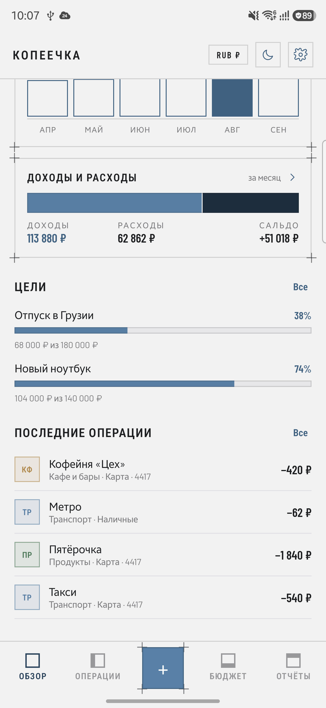
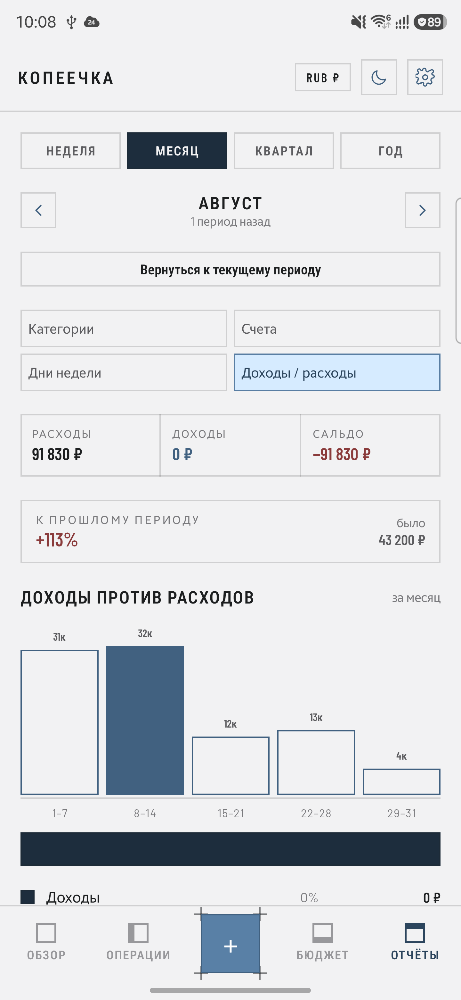
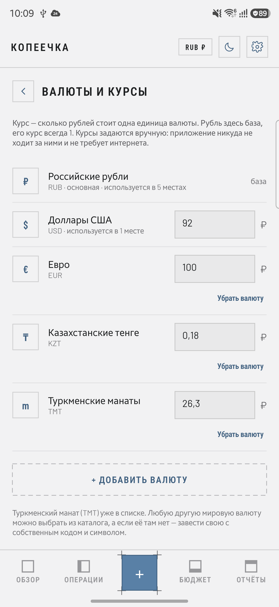

# Копеечка

Учёт личных и семейных финансов: счета в разных валютах, бюджеты, отчёты, цели,
общий бюджет на двоих, чеки по фото, резервные копии в собственный Google Диск
и ИИ-советник по своим данным. Всё хранится на телефоне — сервера у приложения нет.

Kotlin Multiplatform · Compose Multiplatform · Android 8.0+ и iOS 15+ · без аналитики и рекламы.

**[Скачать APK последней сборки](https://github.com/MerdanOchanov/kopeechka-android/releases/latest)** —
тестовая сборка со всеми функциями, подписана отладочным ключом. Версия для Google Play
выходит без чтения СМС и поверх этой сборки не устанавливается (см. [docs/PLAY.md](docs/PLAY.md)). Резервные копии в Google Диск заработают
только у аккаунтов, добавленных в тестировщики OAuth-клиента (см. [docs/GOOGLE_DRIVE.md](docs/GOOGLE_DRIVE.md));
всё остальное работает без интернета.

<p align="center">
  
  
  
</p>

## Возможности

**Деньги**
- Счета в любых валютах: карты, наличные, накопления, вклады. Любой счёт можно исключить из общего баланса.
- Расходы, доходы и переводы между счетами с автоматическим пересчётом по курсу.
- Каталог из 70 мировых валют (включая туркменский манат) плюс возможность завести свою.
  База курсов — ваша основная валюта (выбирается на заставке): у неё курс всегда 1,
  остальные задаются относительно неё вручную. Смена основной валюты пересчитывает курсы сама.
- Курс пары можно поправить прямо в окне операции — удобно, когда обменял по своему курсу.
- Обмен через CSV: выгрузка за неделю, месяц, квартал, год или целиком и загрузка по шаблону
  (неизвестные счета и категории создаются сами).
- Цели и накопления: «отложить» списывает сумму со счёта и двигает прогресс цели;
  сумму можно выбрать из готовых или ввести свою.

**Вместе**
- Общий бюджет на двоих: два телефона ведут одни счета и операции.
- Обмен через общий аккаунт Google, WebDAV (Яндекс.Диск, Nextcloud) или напрямую по Wi-Fi.
- Записи сливаются без потерь: побеждает более поздняя правка, удалённое не возвращается,
  у каждой операции есть автор, похожие покупки от двоих показываются как дубли.
- Заявки на расход: с общего счёта от порога трата ждёт одобрения второго — см. [docs/SYNC.md](docs/SYNC.md).

**Без ручного ввода**
- Чеки по фото: ИИ-провайдер по вашему ключу читает магазин, дату, сумму и позиции.
- Банковские СМС (сборка с GitHub): правила по отправителю, привязка к счёту и маске карты,
  проверка правила на настоящей смске, разбор истории за 90 дней.
- И чек, и смска попадают «На проверку» — в деньги ничего не пишется без вашего подтверждения.

**Долги**
- Дать или взять в долг — прямо на экране новой операции: кому, сколько, когда вернуть и сколько вернётся.
- Тело долга меняет остаток счёта, но не попадает в расходы и бюджеты; заработок сверх тела — настоящий доход.
- Возвраты по частям, просрочка красным, ставка в процентах — см. [docs/DEBTS.md](docs/DEBTS.md).

**Бизнес (по желанию)**
- Заказы, клиенты и прайс — включается на заставке или в настройках, выключенный модуль не виден.
- Оплата заказа создаёт обычную операцию дохода, поэтому выручка сразу в балансе и в отчётах.
- Прибыль и маржа считаются по затратам позиций; со счёта они списываются только по вашей галочке.
- Разрезы «Товары» и «Клиенты» в отчётах, выгрузка заказов в CSV.
- Складского учёта и основных средств здесь нет — см. [docs/BUSINESS.md](docs/BUSINESS.md).

**Понимание**
- Бюджеты: месячные лимиты по категориям, «можно тратить столько-то в день».
- Отчёты за неделю, месяц, квартал или год, со стрелками по периодам назад и вперёд
  и сравнением с тем же отрезком прошлого периода.
- Фильтры по счёту и категории прямо в отчёте: видно, куда уходят деньги с одной карты.
- Четыре разреза: категории, счета, дни недели, доходы против расходов.
- На главном — карточки отчётов: куда уходят деньги, расходы по дням, динамика по месяцам,
  доходы и расходы. Нажатие открывает соответствующий разрез.
- Свой цвет категории из палитры — виден в списках, бюджете и отчётах.

**Удобство**
- Три языка: русский, английский, туркменский. По умолчанию — как в системе, переключается в настройках.
  Меняются интерфейс, названия валют, месяцы, разделители чисел, подсказки ИИ и демо-данные.
- Экран новой операции помещается целиком: счета и категории прокручиваются вбок,
  цифровая клавиатура занимает остаток экрана, вертикальной прокрутки нет.
- Светлая и тёмная темы, переключение из шапки.
- Вечернее напоминание записать расходы.
- Копейки можно показывать или скрывать.
- Минус на счетах разрешается галочкой: без неё приложение не даст потратить больше остатка.
- Демо-данные для знакомства и очистка в один шаг.

**Данные под контролем**
- Всё лежит в одном JSON-файле во внутреннем хранилище телефона.
- Резервные копии — в ваш Google Диск, в папку «Копеечка — резервные копии»
  (вручную или раз в день автоматически), восстановление из списка копий.
- ИИ-советник работает по вашему ключу: Claude, OpenAI, Gemini или свой endpoint.
  Ключ шифруется Android Keystore, в копию не попадает. Без ключа — офлайн-разбор.

## Документация

| Документ | О чём |
| --- | --- |
| [docs/ARCHITECTURE.md](docs/ARCHITECTURE.md) | из чего собрано приложение и почему так |
| [docs/DATA_MODEL.md](docs/DATA_MODEL.md) | формат хранения и резервной копии, поле за полем |
| [docs/BUILD.md](docs/BUILD.md) | сборка, подпись, особенности Windows |
| [docs/GOOGLE_DRIVE.md](docs/GOOGLE_DRIVE.md) | настройка Диска для себя и для распространения |
| [docs/AI_ADVISOR.md](docs/AI_ADVISOR.md) | провайдеры, ключи, что именно уходит в запрос |
| [docs/BUSINESS.md](docs/BUSINESS.md) | заказы, клиенты, прайс: как считаются выручка и прибыль |
| [docs/DEBTS.md](docs/DEBTS.md) | долги: почему тело долга не расход и как считается заработок |
| [docs/SYNC.md](docs/SYNC.md) | общий бюджет: слияние, способы обмена, заявки на расход |
| [docs/PLAY.md](docs/PLAY.md) | варианты сборки, ключ загрузки, выпуск в Google Play |
| [docs/PRIVACY.md](docs/PRIVACY.md) | политика конфиденциальности |
| [CHANGELOG.md](CHANGELOG.md) | что менялось |

## Быстрый старт

```bash
gradlew.bat :app:assembleFullDebug
adb install -r app/build/outputs/apk/full/debug/app-full-debug.apk
```

Нужны JDK 17+ и Android SDK (platform 35, build-tools 35.0.0); путь к SDK — в `local.properties`.
Подробности и решение ошибки `Unable to establish loopback connection` — в [docs/BUILD.md](docs/BUILD.md).

Резервные копии заработают после регистрации OAuth-клиента в Google Cloud:
имя пакета `app.kopeechka.finance` плюс SHA-1 вашего ключа подписи — см. [docs/GOOGLE_DRIVE.md](docs/GOOGLE_DRIVE.md).

## Структура

Приложение собрано как Kotlin Multiplatform: почти весь код общий, платформам
остаются только их особенности.

```
shared/src/commonMain/    общий код — данные, расчёты, языки, сеть и весь интерфейс
  data/    Model.kt · Calc.kt · Business.kt · Debts.kt · Csv.kt · Currencies.kt
           Sync.kt (слияние) · Requests.kt · Inbox.kt (чеки, черновики) · Sms.kt
           Dates.kt · Format.kt · Palette.kt · Demo.kt · Lang*.kt
  net/     Ai.kt (Claude, OpenAI, Gemini, свой endpoint) · DriveApi.kt · Http.kt
           SyncTransport.kt (Google Диск, WebDAV, Wi-Fi)
  ui/      Root.kt · Screens.kt · Overlays.kt · Settings.kt · Business.kt
           Debts.kt · SyncPage.kt · Requests.kt · Inbox.kt · Sms.kt
           DateSheet.kt · Components.kt · Icons.kt · theme/
  AppViewModel.kt · Ports.kt (границы с платформой) · SmsInbox.kt

shared/src/androidMain/   движок HTTP и шрифты с запасным семейством для кириллицы
shared/src/iosMain/       файл данных, Keychain, уведомления, точка входа Compose

app/                      Android: точка входа, реализации портов, фоновые задачи,
                          приём СМС, сервер обмена по Wi-Fi, тесты слияния
  src/play/               манифест варианта для Google Play (без СМС)
iosApp/                   iOS: SwiftUI-обёртка и project.yml для XcodeGen
tools/                    icon-preview.html — эскиз иконки в браузере
```

`Ports.kt` описывает всё, чего не бывает в общем коде: файл данных, шифрованные
ключи, напоминания, системные диалоги файлов и вход в Google. Android и iOS
реализуют эти интерфейсы по-своему, а экраны об этом не знают.

## Происхождение

Интерфейс вырос из двух прототипов, собранных в [Claude Design](https://claude.ai/design):
строгий «чертёжный» дизайн (система Industry: квадратные углы, волосяные рамки,
метки «+» по углам, шрифты Barlow) и функциональная часть второго прототипа —
цели, управление категориями, онбординг, комментарии к операциям.
